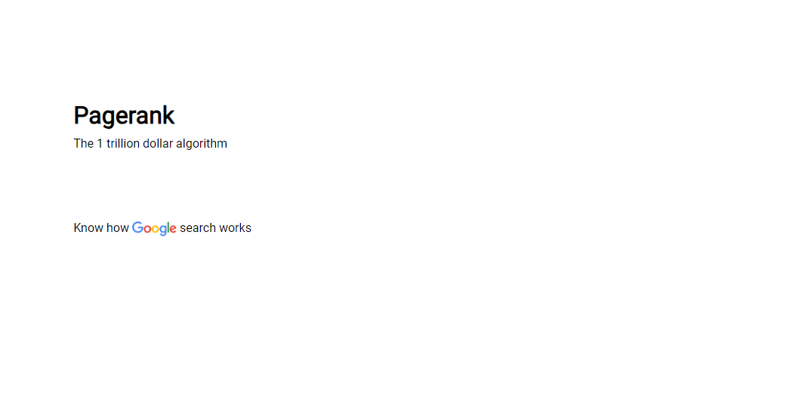
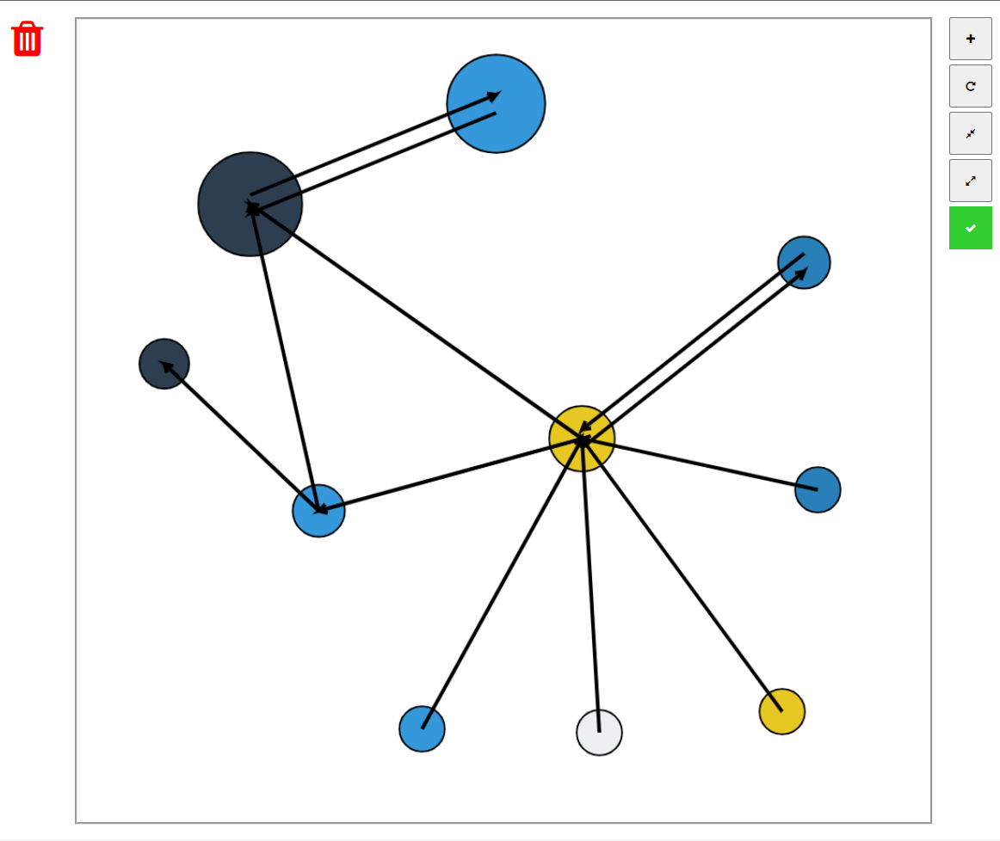

# Pagerank
## A visualizer for Google's search algorithm

Implemented using JavaScript.

### Usage

Open de file index.html in this repo directory  

### Specification

- Slideshow: explain the history and logic behind the algorithm

- Playground: circles represents websites. Drag arrows to create hyperlinks, and when your structure is done, click the green button to see the weight the algorithm given to each website.

